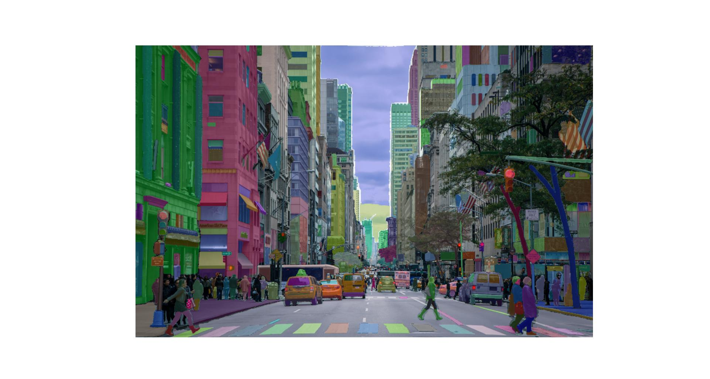

# Segment All The Things


### Test implementation of Segment Anything

https://github.com/facebookresearch/segment-anything/

<hr>

Sample image `complex.jpg` by Nout Gons from Pexels:      
https://www.pexels.com/photo/city-street-photo-378570/

Sample image `dog.jpg` from segment anything project

<hr>

Open a command prompt and `cd` to a new directory of your choosing:

(optional; recommended) Create a virtual environment with:
```
python -m venv "venv"
venv\Scripts\activate
```

To install do:
```
git clone https://github.com/vluz/SegmentAllTheThings.git
cd SegmentAllTheThings
pip install -r requirements.txt
```

Dowload the model from here:      
https://dl.fbaipublicfiles.com/segment_anything/sam_vit_h_4b8939.pth

Put it in the same directory as segment.py

To run do:<br>
`python segment.py` 

<hr>

Output:       


<hr>

Do not use for production, untested.

<br>
